<!-- @import "[TOC]" {cmd="toc" depthFrom=1 depthTo=6 orderedList=false} -->

<!-- code_chunk_output -->

- [数据结构](#数据结构)
  - [链表](#链表)
    - [单链表](#单链表)
    - [单链表增删改查](#单链表增删改查)
    - [双向链表结构图](#双向链表结构图)
    - [双向链表的增删改查](#双向链表的增删改查)
  - [顺序表](#顺序表)
    - [反转链表](#反转链表)

<!-- /code_chunk_output -->
<!-- more -->

# 数据结构

## 链表

### 单链表

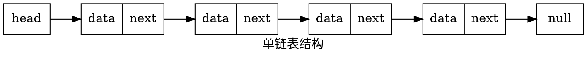

### 单链表增删改查

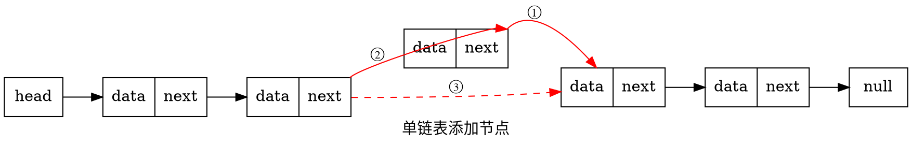

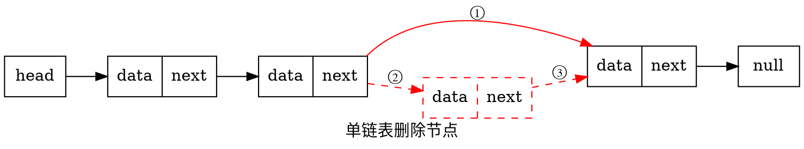

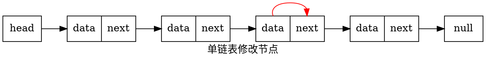

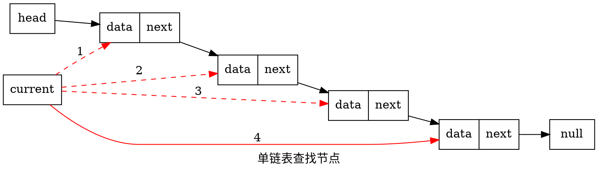

### 双向链表结构图

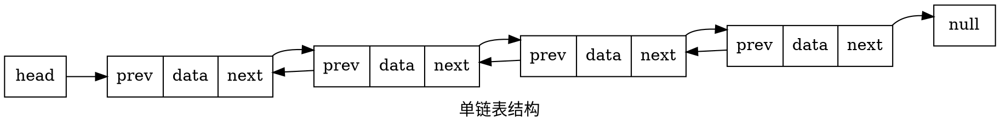

### 双向链表的增删改查

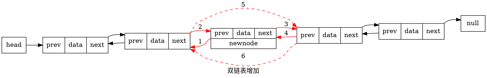

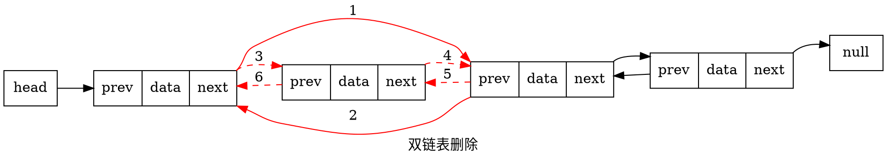

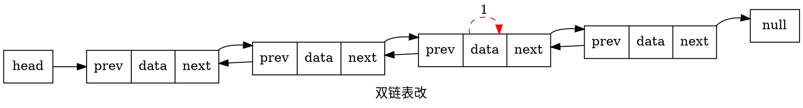

## 顺序表

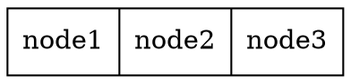

### 反转链表

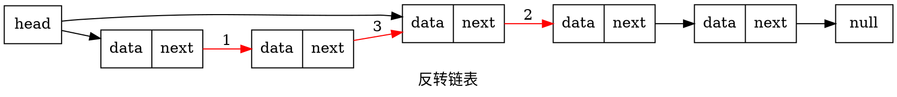
