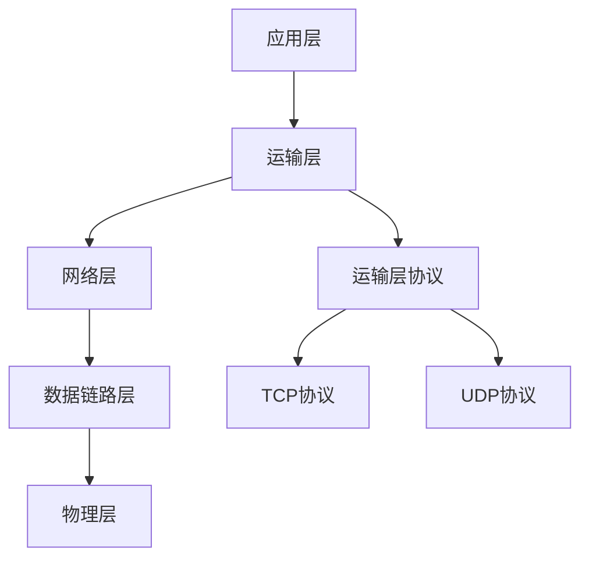

<!-- @import "[TOC]" {cmd="toc" depthFrom=1 depthTo=6 orderedList=false} -->

<!-- code_chunk_output -->

- [运输层](#运输层)
  - [运输层服务](#运输层服务)
  - [运输层协议以及工作流程](#运输层协议以及工作流程)
  - [运输层协议 - UDP协议](#运输层协议-udp协议)
  - [运输层协议 - TCP协议](#运输层协议-tcp协议)
  - [多路复用以及多路分解](#多路复用以及多路分解)
    - [套接字](#套接字)
  - [UDP](#udp)
  - [可靠数据传输原理](#可靠数据传输原理)
  - [面向连接的运输 TCP](#面向连接的运输-tcp)
    - [TCP的工作模式](#tcp的工作模式)
    - [TCP的工作流程](#tcp的工作流程)
    - [TCP报文段结构](#tcp报文段结构)

<!-- /code_chunk_output -->
<!-- more -->


# 运输层

运输层所在的位置 运行在不同主机上的应用进程提供直接的通信服务


## 运输层服务
运输层协议为运行在不同主机上的应用进程之间提供了`逻辑通信`,通过逻辑通信，运行在不同进程的主机好像直接相连一样
但实际上这些主机相距很远，可能是由多个路由设备以及多种类型的链路连接在一起。应用进程使用运输层提供的逻辑通信功能彼此发送报文，不需要考虑承载这些报文的物理设备


## 运输层协议以及工作流程
运输层协议是在端系统中而不是路由器中
```bash
- 发送端
1. 运输层将发送应用程序进程接收到的报文转换成运输层分组 该运输层分组被称作 报文段
2. 紧接着，运输层将这些报文段传递给网络层， 网络层将其封装成网络层分组被称作 数据包  并向目的地转发
3. 向目的地转发的过程中则要经历 数据链路层-> 物理层 -> 对端物理层 -> 对端数据链路层 -> 网络层
```
运输层中的协议主要有`TCP协议`以及`UDP协议 `
另外运输层会受到网络层的影响，但即是是这样运输层也能使用加密来保证应用程序报文不被入侵者读取

::: tip
自顶向下这本书里面说 P124
有很多文献里面将TCP的运输层分组叫做报文段，将UDP的运输层分组叫做数据报
但是<<自顶向下>>书里面统称运输层上的分组为报文段，而将网络层上的分组称之为数据报
:::


::: tip
介绍一下网络层中的`网际协议`  即IP 
IP为主机之间提供了逻辑通信 IP的服务模型是尽力而为交付服务
也就是说IP会尽自己最大的努力，在通信的主机之间交付报文段 但他不确保报文段的交付，不拨正报文段的按序交付，不保证报文段数据的完整性
因此 IP也是一种不可靠服务

:::

## 运输层协议 - UDP协议
UDP(用户数据报协议)  为调用他的应用程序提供了一种不可靠、无连接的服务
UDP之所以被称作是无连接的服务，是因为他在发送报文段之前是没有握手，也就是没有了第一第二阶段

UDP仅提供两种服务
- 进程与进程之间的数据交付
- 差错检查
这也是最基本的两个运输层服务
UDP传输的应用程序可以根据其需要以其意愿的任何速率发送数据

UDP是由一个二元组全面标识的，该二元组包含一个目的IP地址和一个目的端口号


::: tip
UDP使用过程
1. UDP从应用进程获取数据，从不同的套接字中获取数据（多路复用） 封装目的地址和目的端口
2. 将报文段教给网络层
3. 网络层将报文段封装成数据报
4. 然后尽全力放到对端机器
5. 对端机器收到数据报以后拆分教给运输层
6. 运输层拆分报文段 获取目的端口和目的地址 通过套接字交付给应用进程
:::


## 运输层协议 - TCP协议
TCP(传输控制协议)  提供了一种可靠的 面向连接的服务
TCP是一种可靠的运输层协议
通过 流量控制 序号 确认和定时器来讲网络层交付的数据报拆分成报文段 并且将不可靠的IP服务转换成可靠的TCP服务

- TCP的拥塞控制防止任何一条TCP连接过量的流量来淹没通信主机之间的链路和交换设备
- 保证一条拥塞网络链路的连接平等的共享网络链路带宽 通过调节TCP连接发送端发送进网络的流量速率

TCP套接字是由一个四元组组成的，包含 源IP地址 源端口号 目的IP地址 目的端口号


## 多路复用以及多路分解

在目的主机，运输层从下面的网络层接收数据报拆分成报文段。紧接着运输层将这些报文段通过交付给`套接字`将数据交给适当的应用程序


::: tip
接收端  每个运输层中都包含几个字段，在接收端，运输层接收报文段，并且标识出接收的套接字，进而将报文段定向到该套接字。将运输层报文段中的数据交付到正确的套接字工作就叫做多路分解
发送端  源主机从不同的套接字中收集数据块，并为某个数据块封装上首部信息后 生成报文段，然后报文段通过网络层 这些工作叫做多路复用
:::

### 套接字
多路复用的实现主要依靠套接字和运输层来实现，其中套接字需要满足两个条件
- 套接字有唯一标识符;
- 每个报文段有特殊字段来指示该报文段所要交付到的套接字
这些特殊字段中包含 `源端口号` + `目的端口号` ,端口号是一个16比特的数字，大小在0~65535之间，但是其中0~1023是一些`周知端口号`，仅提供给固定的服务使用 比如http 80端口 ftp 21端口 

UDP是由一个二元组全面标识的，该二元组包含一个目的IP地址和一个目的端口号
TCP套接字是由一个四元组组成的，包含 源IP地址 源端口号 目的IP地址 目的端口号

套接字会分解这些元组，并将他们分配到不同的套接字

:::  tip 
这里UDP和TCP会有一些不同

首先如果UDP的源地址不同，但是他们的目的地址相同 ，则会被分配到同一个套接字上面
但是同样情况对于TCP来说，他们会被分配到不同的套接字上
你可以理解为  对于UDP 仅识别目的 因为他只带了目的地址和端口
而对于TCP来说 是一一对应的关系。

在现代的web服务器中，更多的web服务器通常指使用一个进程+多个线程的工作形式，每次有新的客户端连接的时候，都会重新开一个线程上来 ，这个线程上包含了新的套接字
:::


## UDP
DNS同时占用的了UDP和TCP的53端口，再大部分情况下DNS采用UDP协议
:::  tip 
DNS UDP 使用流程
1. 当你想要查询某个名字服务器的时候
2. 构建一个DNS查询报文并将其交个UDP
3. UDP不需要执行握手流程，直接被网络层封装成数据报发送到对端
4. 如果有响应 则成功  如果没有响应 则通知到应用程序无响应

:::

UDP的优点(P131)


## 可靠数据传输原理
可靠数据传输的实现不仅存在于运输层还出现在链路层和应用层
可靠传输的实现主要依靠一条可靠的信道完成，数据通过一条可靠的信道进行传输，因为信道的存在，插孙湖数据比特就不会收到损坏，有0变为1，或者相反。而这个服务模型九四TCP向调用他的因特网应用所提供的服务模型，这种服务模型遵循的协议为 `可靠输出传输协议`

P134

## 面向连接的运输 TCP
TCP连接是`面向连接的`，这是因为在一个应用进程可以开始向另一个应用进程发送数据之前，这两个进程必须先相互`握手`
TCP/IP协议也就是传输控制协议/网际协议

### TCP的工作模式
TCP的工作模式是`全双工服务`，如果主机上的进程A与另一台主机上的进程B存在一条TCP连接，那么应用层数据就可以从进程B流向进程A 的同时，也从进程A流向进程B 
TCP的连接模式是`点对点`连接，并不是以多播的形似连接，多播即单个发送方会将数据传送给多个接收方，这种情况对TCP来说是不可能的。TCP是单个发送方 单个接受方


### TCP的工作流程
1. 应用层数据通过套接字将数据发送到运输层
2. 运输层获取这些数据，并交给TCP协议来处理
3. TCP将这些数据引导到该连接的发送缓存里，(发送缓存是发起三次握手期间设置的缓存之一)
4. TCP从缓存中取出一块数据以报文段的形式发送数据

TCP可从缓存中取出并放入报文段中的数据数量受限于`最大报文段长度(MSS)`
`MSS`通常根据最初确定的由本地发送主机发送的最大链路即度(即最大传输单元MTU)来决定 

TCP为每块客户数据添加一个TCP首部，这样就形成了多个TCP报文段，然后这些报文段下传到网络层，网络层将其封装在网络层IP数据报中。然后将这些IP数据报被发送到网络中。当TCP在另一端接收到报文段之后，该报文段的数据就被放入该TCP连接的接收缓存中。应用程序从此缓存中读取数据流。因为TCP是全双工的工作模式，因此它的每一端都有各自的发送缓存和接收缓存
 


### TCP报文段结构

上面的是TCP的报文段，其中
- 首部包括源端口号和目的端口号
- 32比特的序号字段(se) 32的确认号字段(ack)  后面用握手和挥手用的
- 16比特的接收窗口字段 该字段用于流量控制。用于指示接收方原因接收的字段数量
- 4比特的首部长度 该字段指示了以32比特的字为单位的TCP首部长度。当选项字段为空的时候，TCP首部的长度为20
- 可选与变长的选项字段，改字段用于发送方与接收方协商最大的报文字段长度(MSS)
- 6比特的标志字段 ACK比特用于指示确认字段中的值是有效的，即该报文段包括一个对已被成功接收报文段的确认
- RST、YSN、FIN比特用于连接建立和拆除。当PSH被比特被置为1时，就表示接收方应立即将数据交给上层 
- URG比特用来指示报文段里存在着被发送端的上层实体为紧急数据。紧急数据的最后一个字节由16比特的紧急数据指针字段指出，当紧急数据存在并给出指向紧急数据尾指针的时候，TCP必须通知接收端的上层实体
  
