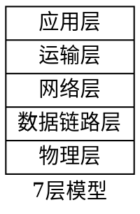
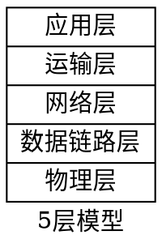
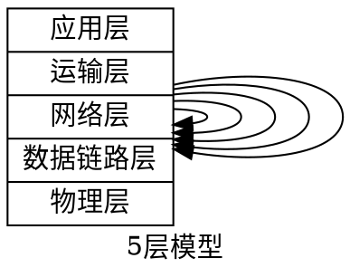
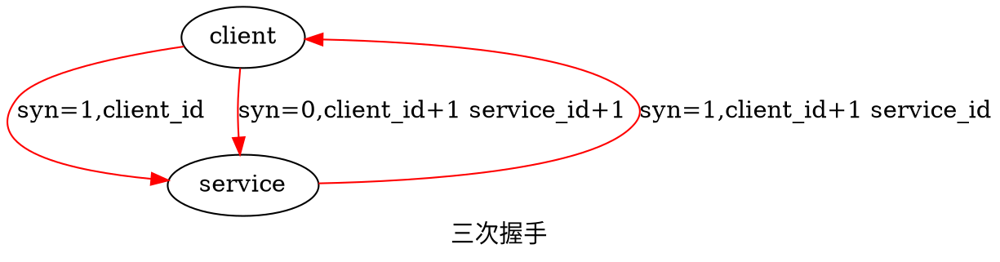
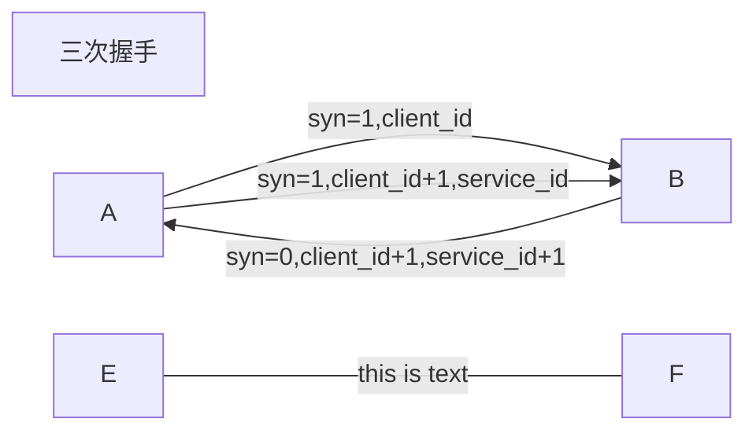
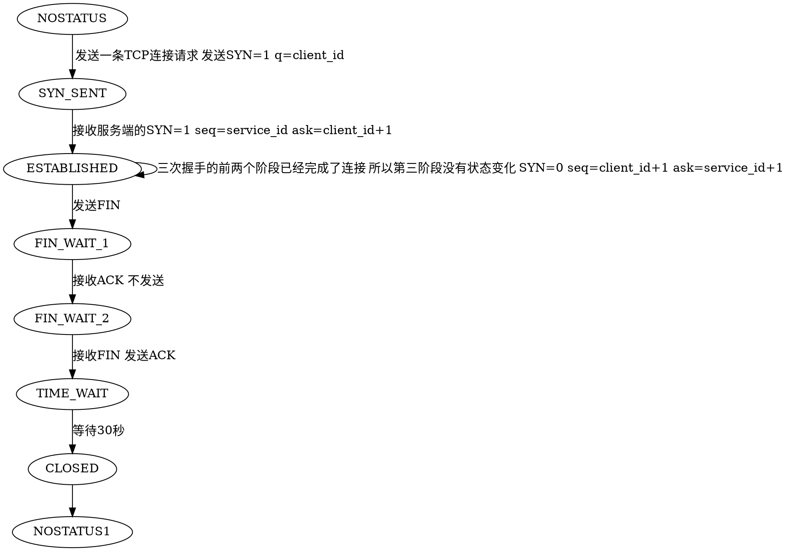
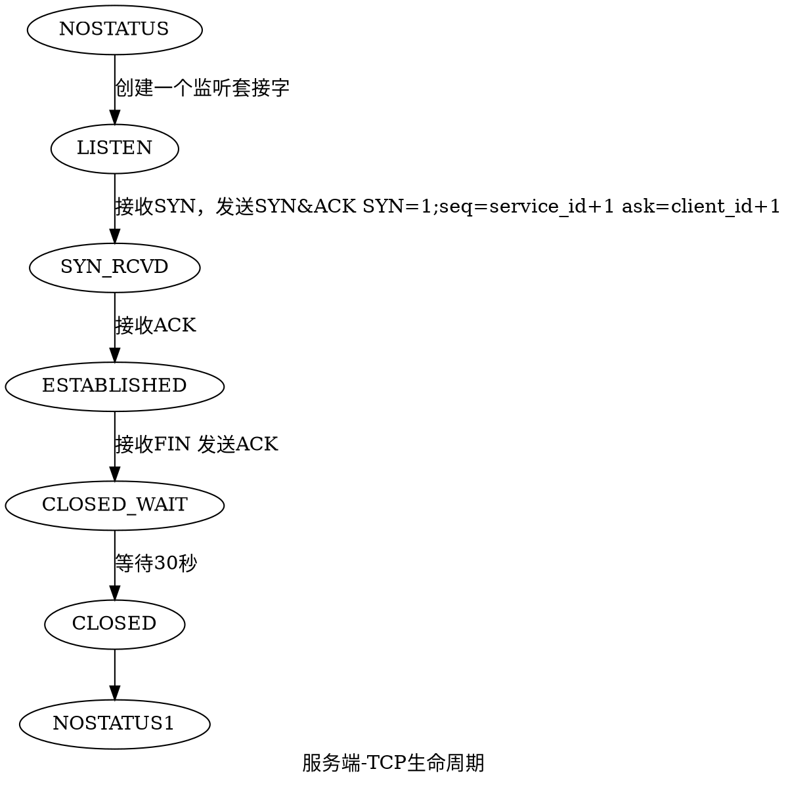
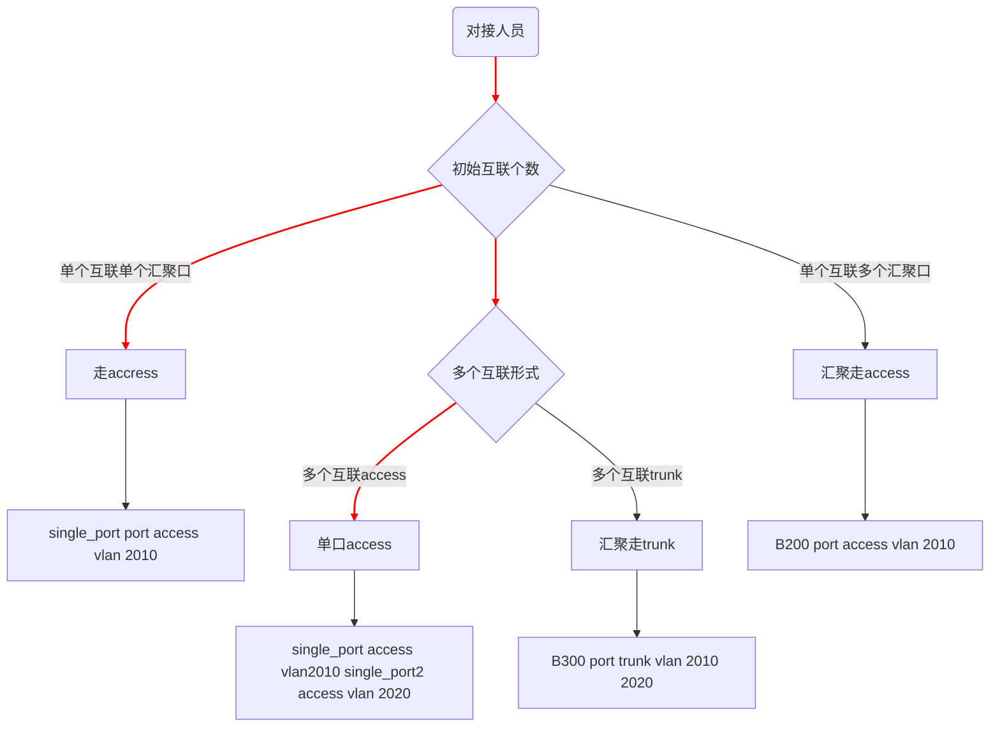

<!-- @import "[TOC]" {cmd="toc" depthFrom=1 depthTo=6 orderedList=false} -->

<!-- code_chunk_output -->

- [网络graphviz图](#网络graphviz图)
  - [ISO七层模型](#iso七层模型)
  - [TCP/IP5层模型](#tcpip5层模型)
  - [TCP/IP5层模型互动](#tcpip5层模型互动)
  - [三次握手与四次握手模型](#三次握手与四次握手模型)
  - [机房互联对接流程](#机房互联对接流程)

<!-- /code_chunk_output -->
<!-- more -->

# 网络graphviz图

## ISO七层模型

## TCP/IP5层模型

## TCP/IP5层模型互动

## 三次握手与四次握手模型

## 机房互联对接流程

