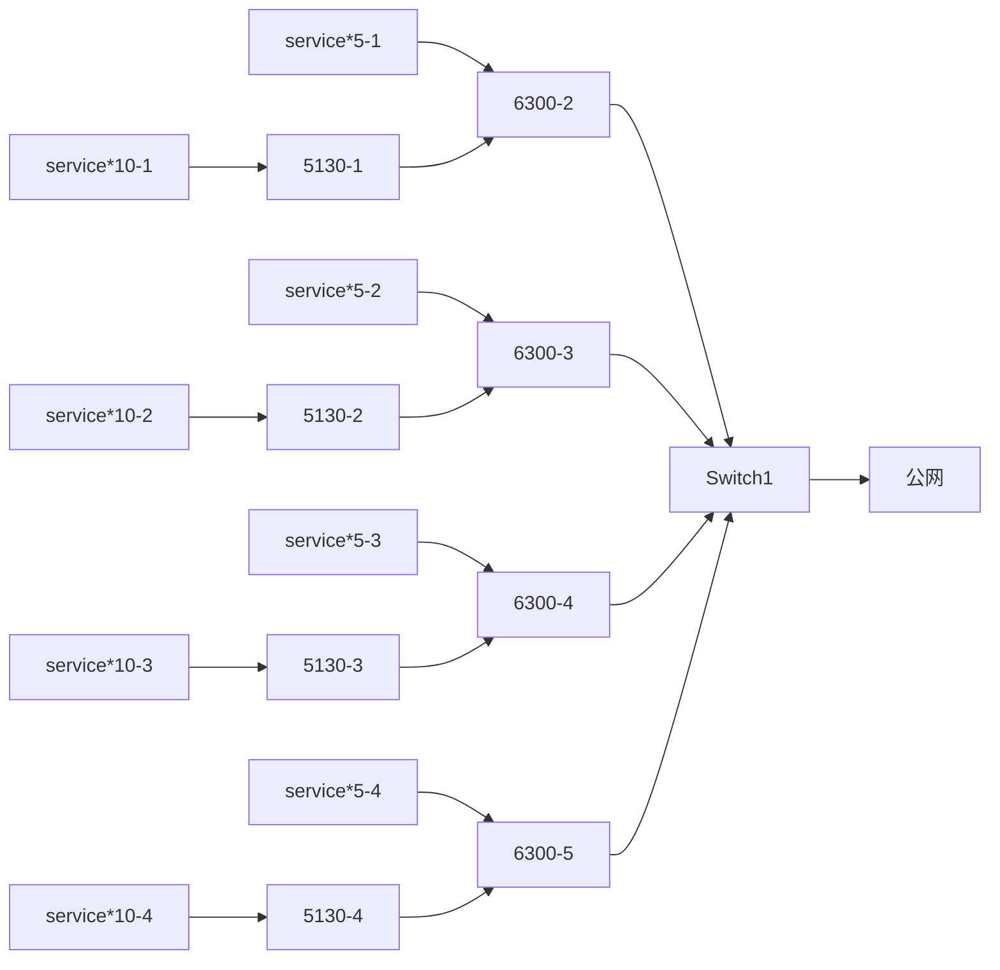

<!-- @import "[TOC]" {cmd="toc" depthFrom=1 depthTo=6 orderedList=false} -->

<!-- code_chunk_output -->

- [Question](#question)
  - [TCP三次握手以及四次挥手](#tcp三次握手以及四次挥手)
  - [交换机端口动态汇聚和静态汇聚的优缺点对比](#交换机端口动态汇聚和静态汇聚的优缺点对比)
  - [设计一个有100台左右服务器网络架构，有一个总计100G带宽的公网出口，交换机型号和使用数量不限，内部互联接口类型不限，需要考虑高可用和负载均衡](#设计一个有100台左右服务器网络架构有一个总计100g带宽的公网出口交换机型号和使用数量不限内部互联接口类型不限需要考虑高可用和负载均衡)
  - [罗列交换机IRF优缺点](#罗列交换机irf优缺点)
  - [举例ECMP负载均衡的常用场景](#举例ecmp负载均衡的常用场景)
  - [根据下图是否可以判断存在网络攻击？](#根据下图是否可以判断存在网络攻击)
  - [数据中心内部网络需要开放一个对公网开放的服务，有哪些方法来实现？](#数据中心内部网络需要开放一个对公网开放的服务有哪些方法来实现)
  - [linux的网络性能瓶颈在哪里？有什么手段来提高linux的网络性能？](#linux的网络性能瓶颈在哪里有什么手段来提高linux的网络性能)
  - [linux作为NAT网关需要进行哪些配置](#linux作为nat网关需要进行哪些配置)
    - [VPC与ESC](#vpc与esc)
    - [介绍nat snat dnat](#介绍nat-snat-dnat)
    - [数据中心内外网转发的形式](#数据中心内外网转发的形式)
    - [边缘节点外to内的转发形式](#边缘节点外to内的转发形式)
    - [配置SNAT与DNAT](#配置snat与dnat)
  - [需要在一台服务器上对异常大流量进行定位分析，有哪些方法？](#需要在一台服务器上对异常大流量进行定位分析有哪些方法)

<!-- /code_chunk_output -->

<!-- more -->


# Question

## TCP三次握手以及四次挥手

三次握手
1. 客户端发送建立连接信号 (SYN=1;seq=client_id)
2. 服务端接收客户端返回确认信息  (SYN=1;seq=service_id;ack=client_id+1)
3. 客户端接收确认信息，此时已经建立建立，返回一个报文段 (SYN=1;seq=client_id+1;ack=service_id+1)

四次挥手
1. 客户端发起终止信号 (FIN=1)
2. 服务端收到终止信号，返回确认信号(ACK)
3. 服务端发送终止信号(FIN=1)
4. 客户端收到终止信号，返回确认信号(ACK) ，服务收到信号后关闭连接 释放缓存
5. 客户端等待一段时间后，关闭连接，释放缓存

握手注意点 第一阶段-第二阶段会发生SYN泛洪 解决方法 使用SYN cookie，服务器接收到第一阶段的建立连接信号后，不会发生半开连接，会先生成一段序号(service_id)返回给客户端，客户端带着这段序号+1 以及确认信号去请求服务器，服务器再次进行计算+1 比较service_id+1 相同则为合法连接，产生一个全开链接

<font color='red'>TCP生命周期要写上去嘛</font>

## 交换机端口动态汇聚和静态汇聚的优缺点对比
动静态汇聚主要依靠的协议是链路聚合协议 (lacp)，链路聚合主要作用就是把多条物理链路绑定成几组逻辑链路，逻辑链路的存在一是可以起到备份的作用，二是可以起到增加带宽的作用
静态汇聚的优点是配置完成以后 端口的选中/非选中状态就不会受网络环境的影响，比较稳定。但同样的 缺点在于不能根据对端的状态调整端口的选中/非选中状态，不够灵活 
而动态汇聚的有点在于，会自动协商汇聚口上选中与非选中的状态 能够根据对端和本端的信息调整端口的选中/非选中状态，比较灵活   但是缺点在于会受到网络环境的影响
所以对于这两种状态是两个正反面，不同的环境选择使用不同的配置
现在公司的配置默认统一为动态汇聚，这样做的好处是可以保证在之后扩口的时候方便操作，只需要划一个新的口到汇聚口里面去就好了
```bash
# 配置动态汇聚
link-aggregation mode dynamic
# 查看链路汇聚协商状态
dis link-aggretion summary # 当Partner ID出现mac地址时候，则表示处于协商状态
```

## 设计一个有100台左右服务器网络架构，有一个总计100G带宽的公网出口，交换机型号和使用数量不限，内部互联接口类型不限，需要考虑高可用和负载均衡




## 罗列交换机IRF优缺点
优点:
1. 配置方便,统一配置，IRF连接之后，只要在一台机器上进行配置管理就好了 简化管理
2. 高扩展性，增加成员设备，可以轻松自如地扩展IRF的端口数，带宽。
3. 高可靠性，两个交换机之间进行互备 其中一台挂了，另外一台会被选举成为新的master


缺点:
1. 建立IRF体系 初期有点麻烦，配置还要重启，配置过程中步骤先后还很容易出错，建立初期蛮痛苦的
2. 堆叠交换机需要是同一类的交换机牌子


## 举例ECMP负载均衡的常用场景
ECMP 即等价(equal cost )路径，主要存在于有多条链路到达同一目的地址的网络环境中。当设备支持等价路由时，发往该目的数据包可以通过不同的路径分担，实现网络的负载均衡，并在其中某些路径出现故障时，由其它路径代替完成转发处理，实现路由冗余备份功能。

ECMP算法被多种路由协议支持，例如：OSPF、BGP等  `P254`

ECMP的路径选择策略
- 哈希，例如根据源IP地址的哈希为流选择路径。
- 轮询，各个流在多条路径之间轮询传输。
- 基于路径权重，根据路径的权重分配流，权重大的路径分配的流数量更多。


<!-- https://www.sdnlab.com/20605.html -->


## 根据下图是否可以判断存在网络攻击？
pass 


## 数据中心内部网络需要开放一个对公网开放的服务，有哪些方法来实现？
1. 拿一台服务器当防火墙 或者在当前机器上的防火墙上做NAT转发  (NAT版)
2. frp内网穿透
3. 那一台服务器当代理转发服务器   所有内外网交互全交给代理服务器做转发 (Nginx版本)

## linux的网络性能瓶颈在哪里？有什么手段来提高linux的网络性能？
1.硬件设备
2.


## linux作为NAT网关需要进行哪些配置 


### VPC与ESC
VPC  virrual Private Cloud 私有云
ESC  Elastic Compute Service 云服务器

搭建NAT网关的主要作用就是为了实现在相同VPC内，没有公网IP的ECS借助有公网IP的ESC访问外网，或者是外网通过端口映射访问到内网服务器

SNAT  实现没有公网IP的ECS实例借助有公网的ECS访问外网，但是外网无法访问到内网IP；也就是仅对源网络地址转换
DNAT  实现外网通过端口映射访问到内网服务器，但是不能实现内网ECS访问到外网； 也就是仅对目的网络地址进行转换

### 介绍nat snat dnat
别名IP地址欺骗或者伪装
NAT也就是`网络地址转换` network address translation 
主要是通过IP数据包中的IP地址进行转换的 内外网地址转发==>内网地址与外网地址转换
DNAT `目的网络地址转换` destination network addres 
SNAT `源网络地址转转换` source network address

需要网络地址转发的原因是 

内网机器A向外网机器发出一个IP数据包，如果SNAT没有对A主机进行源地址转换，A和B的连接就会发生不正常终端，因为当路由器将外网的数据包发送到外网后，公网IP会给你的死亡IP回数据包，这时候公网IP根本就无法知道你的私网IP应该如何走。所以他会去问上一级的路由器，因为在公网中无法看到私网的IP，无法建立通信，为了实现数据包的正确发送及返回，网关必须将A的地址转换为一个合法的公网地址，同时为了以后B主机能将数据包钻发给A 这个合法的公网地址必须是网关的外网地址


### 数据中心内外网转发的形式 


NAT做地址转发是有消耗的，一般会建一组NAT机器去做NAT地址转发，此时这组机器相当于内外网地址转发的中心，所有的请求都会过这里
其中请求包较小，响应包或大或小

所有服务器上都仅配有内网地址

### 边缘节点外to内的转发形式


外网请求走NAT
内网响应包走服务器自带的外网IP
NAT到服务器


### 配置SNAT与DNAT
首先配置SNAT，让内网机器能够访问到外网机器
```bash
echo "net.ipv4.ip_forward = 1" >> /etc/sysct.conf
iptables -t nat -I POSTROUTING -s 172.16.0.0/16 -j SNAT --to-source 172.16.107.49
service iptables save
systemctl restart iptables.service
```


## 需要在一台服务器上对异常大流量进行定位分析，有哪些方法？

- iftop

找到对应的端口号
```bash
lsof -i:xxx # 找到对应的PID
cat /proc/16276/cmdline # 找到对应的进程
```


- nethogs
https://man.linuxde.net/nethogs
可以直接暴露出PID  

- iptraf
centos7之后 衍生除了iptraf-ng


