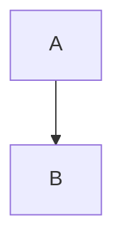
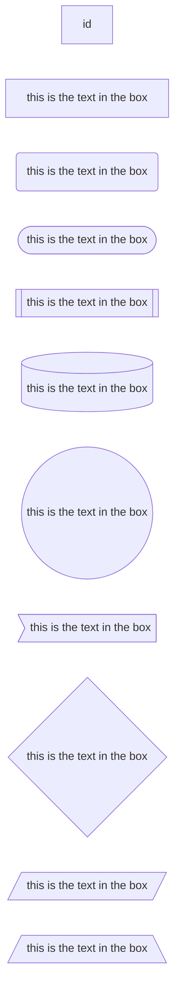
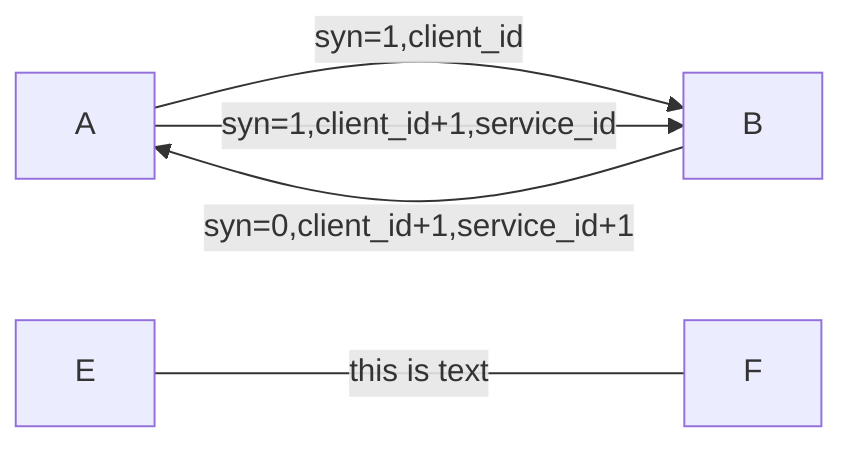

hello,new-world 👨
<!-- more -->


# hello,new-world


cmd.fm
命令行的fm电台
https://cmd.to/fm


# ffmpeg 
视频流下载器，可以使用他+chrome的猴油脚本，批量下载B站的视频
https://ffmpeg.org/ffmpeg.html#Description
https://blog.fat-nerds.com/dot-nerd/install-ffmpeg-mac-os-in-chinese/

```bash
# 安装
brew install ffmpeg --force
# 查看版本
brew link ffmpeg
# 写在
brew uninstall ffmpeg
```

# youtobe-dl
视频下载器，和you-get类似，但是比you-get强大
下载B站视频的时候，明显可以感觉到两者下载速度上面的差别


# 将 Amazon Kindle 的格式转换成为你想要的格式
https://yamdestiny.xyz/2019/05/08/how-to-convert-amazon-kindle-format-to-epub-format/
https://maajiaa.wordpress.com/2018/07/19/kindle-to-calibre/

Kindle for Mac 的电子书存放路径为：/Users/你的用户名/Library/Application Support/Kindle/My Kindle Content。
Kindle for Windows 的电子书存放路径为：C:\Users\你的用户名\Documents\My Kindle Content。

## 软件合集
- calibre  强大的电子书管理工具
- DeDRM 插件，calibre 适用的去除 DRM 的插件工具
- Amazon Kindle 获取的待转换的电子书，格式如：.azw


之前一直在用kindle在pad上看书，后面想要转换到mac上来看，但是mac上的kindle真的是差的想吐血，卡顿十分严重。
为了方便在多个平台内部浏览看书，也不想放弃买电子书的这个念头，所以打算做个格式转换，并且使用calibe来保存

`2020-05-19 14:05:43`
首先的话是`kindle for mac`这个软件在新版本之后 出现了一个叫`.kcr`的后缀名,这个是kindle新的一种书籍加密方式，现在还没有什么破解的办法，
因此我们要下载老版本的`kindle for mac` 来生成`.azw`后缀名的文件


## 安装calibre
- 官网下载
https://calibre-ebook.com/
- homebrew安装
`$ brew cask install calibre`


尽量用下面那个备用地址下载，上面那个经常会出现网络错误

## 安装DeDRM
下载地址https://github.com/apprenticeharper/DeDRM_tools/releases
```bash
1. 打开 calibre，查看选项或偏好选项（Preferences）
2. 点击最下面的高级选项的插件（Plugins）选项，打开插件管理
3. 点击右下角的从文件加载插件（Load plugin from file），在弹出窗口中，选到刚才解压出来的文件夹中的 DeDRM_calibre_plugin/DeDRM_plugin.zip 文件此时会提示有风险问是否继续安装，选择 是（Yes） 即可
4. 然后会提醒需要重启才能生效，点击 确定（Confirm）就可以在文件类型插件（File type plugins）分类中看到 DeDRM，点击左下角的 应用（Apply）
5. 重启 calibre
```
配置DeDRM
```bash
在文件类型插件（File type plugins）分类中看到的 DeDRM，可以选中双击，打开配置窗口。
根据电子书的来源不同，都需要单独配置。比如常用的 elnk Kindle ebooks 和 Kindle for Mac/PC ebooks 选项
elnk Kindle ebooks，单击后会打开一个小窗口，点击 +，添加 Kindle 设备的串号（针对 Kindle 设备，从 Amazon 网站上点击通过 USB 传输，下载的电子书）
Kindle for Mac/PC ebooks，单击后会打开一个小窗口，点击 +，添加默认 key（针对 Mac/PC App 下载的电子书）
```

## 下载kindle for mac
`brew cask install https://raw.githubusercontent.com/Homebrew/homebrew-cask/dd6783ffac00f0fc652c2c4266aa14a4041e1b2b/Casks/kindle.rb`
上面这个是旧版本的kindle 上去以后把自动更新关了

## 转换电子书
```bash
打开 calibre，将 My Kindle Content 中的 .azw 或从 Amazon 网站上下载的文件拖到 calibre 中
在书籍列表中，双击导入的书，如果能够阅读，说明已完成 DeDRM
在书籍列表中，右键该书，选择转换书籍（Convert books -> Convert individually），在弹出窗口中，右上角选择输出格式，点击右下角确认，完成转换
在书籍列表中，右键该书，选择打开所在目录（Open Containing folder），转换后的文件，就在该文件夹中
```

## mac idea无法打开
idea系列的内容无法打开,这个是因为之前安装了破解插件,然后找不到了


解决办法就是
```bash
1. 先删除这条信息,目录为
/Users/alpaca/Library/Application\ Support/JetBrains/GoLand2020.1/goland.vmoptions
Clion就是
/Users/alpaca/Library/Application\ Support/JetBrains/CLion2020.2/clion.vmoptions
以此类推,反正都在JetBrains下面

2. 删除这一行
3. 重新破解
```

## 流程图基本语法

### 排列布局
排列布局分为从上到下(TB or TD) 从下到上(BT) 从左到右(LR) 从右到左(RL)
- TB  top bottom
- TD  top default;like TB
- BT  bottom top
- LR  left right
- RL  right left



### 节点样式
```bash
graph LR
    id   # 这个id是节点名字，在没有内容的情况下 节点默认显示id
    id1[this is the text in the box ]   # 设置节点文本 方框
    id1(this is the text in the box )   # 设置节点文本 圆角框
    id1([this is the text in the box])  # 设置节点文本 椭圆框
    id1[[this is the text in the box]]  # 设置节点文本 子例程
    id1[(this is the text in the box)]  # 设置节点文本 圆柱状
    id1((this is the text in the box))  # 设置节点文本 圆形
    id1>this is the text in the box]    # 设置节点文本 非对称形状
    id1{this is the text in the box}    # 设置节点文本 菱形
    id1{{this is the text in the box}}  # 设置节点文本 六角形
    id1[/this is the text in the box/]  # 设置节点文本 平行四边形
    id1[/this is the text in the box\]  # 梯形
    id1[\this is the text in the box/]  # 倒角梯形  
```


### 链接样式
```bash
graph LR
    A --> B # 箭头链接
    C --- D # 虚连接 
    E -- this is text --- F # 链接上的文字
    G ---|this is text|H  #链接上的文字
    I -->|this is text|J  #箭头和文字的连接
    K -- this is text ---> M 
    A -.-> B  # 虚线连接
    A -. text . -> B # 带有文字的虚线连接
    A ==> B  # 粗连接


```



### 官网
https://mermaid-js.github.io/mermaid/#/flowchart