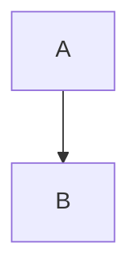
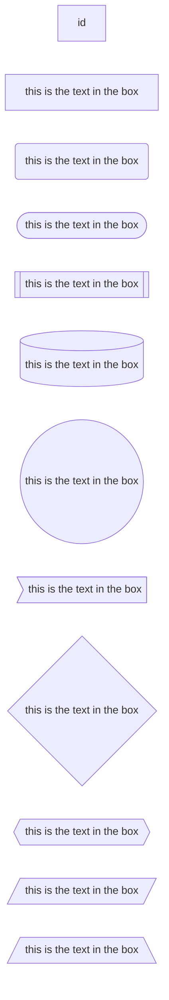
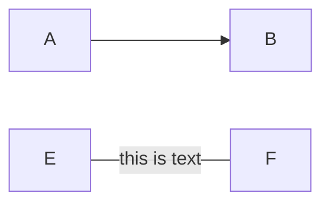

<!-- more -->


# mermaid使用

## 流程图基本语法

### 排列布局
排列布局分为从上到下(TB or TD) 从下到上(BT) 从左到右(LR) 从右到左(RL)
- TB  top bottom
- TD  top default;like TB
- BT  bottom top
- LR  left right
- RL  right left



### 节点样式
```bash
graph LR
    id   # 这个id是节点名字，在没有内容的情况下 节点默认显示id
    id1[this is the text in the box ]   # 设置节点文本 方框
    id1(this is the text in the box )   # 设置节点文本 圆角框
    id1([this is the text in the box])  # 设置节点文本 椭圆框
    id1[[this is the text in the box]]  # 设置节点文本 子例程
    id1[(this is the text in the box)]  # 设置节点文本 圆柱状
    id1((this is the text in the box))  # 设置节点文本 圆形
    id1>this is the text in the box]    # 设置节点文本 非对称形状
    id1{this is the text in the box}    # 设置节点文本 菱形
    id1{{this is the text in the box}}  # 设置节点文本 六角形
    id1[/this is the text in the box/]  # 设置节点文本 平行四边形
    id1[/this is the text in the box\]  # 梯形
    id1[\this is the text in the box/]  # 倒角梯形  
```


### 链接样式
```bash
graph LR
    A --> B # 箭头链接
    C --- D # 虚连接 
    E -- this is text --- F # 链接上的文字
    G ---|this is text|H  #链接上的文字
    I -->|this is text|J  #箭头和文字的连接
    K -- this is text ---> M 
    A -.-> B  # 虚线连接
    A -. text . -> B # 带有文字的虚线连接
    A ==> B  # 粗连接


```



https://mermaid-js.github.io/mermaid/#/flowchart